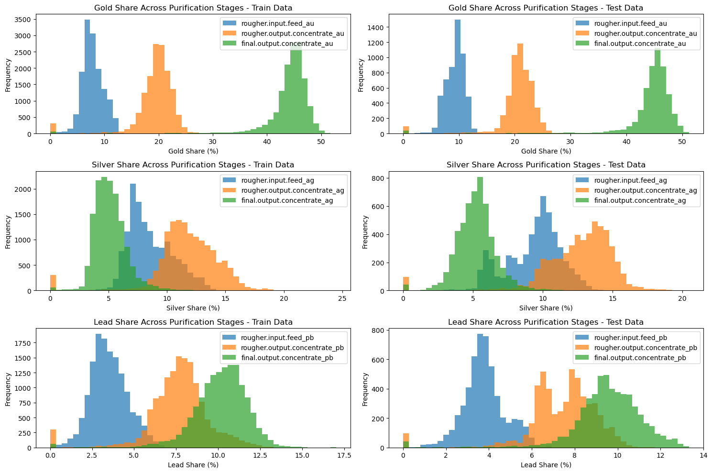

# Sprint 10: Integrated Project 2 – Gold Recovery Prediction

---

## Project Overview

This project focused on predicting gold recovery rates at a purification plant using real industrial data. The work involved understanding the intricacies of the gold purification process, extensive data cleaning, feature engineering, and building regression models to estimate recovery efficiency.

---

## Learning the Gold Purification Process

A significant challenge in this project was learning the multi-stage gold purification workflow while simultaneously preparing the data and developing predictive models. This required not only technical skills in data science, but also a deep dive into the domain knowledge of how gold, silver, and lead are separated and measured at each stage. Understanding the correct calculation of recovery rates and identifying errors in the source data were crucial steps in building reliable models.

---

## Metals Concentration Visualization

A key part of the analysis was comparing the distributions of gold, silver, and lead concentrations at different purification stages. The visualization below summarizes these findings:

*Figure: Distribution of gold, silver, and lead concentrations across purification stages.*

---

## Project Highlights

- Validated and corrected recovery calculations for both rougher and final output stages
- Identified and handled missing values, anomalies, and outliers in the data
- Engineered features and ensured no data leakage between training and test sets
- Built and evaluated regression models using cross-validation and sMAPE as the main metric
- Achieved a final sMAPE of **3.17%** on the test set, outperforming the naive baseline

---

## Outcome

Through a combination of domain learning and technical analysis, the project produced a robust model capable of accurately predicting gold recovery rates. The process deepened understanding of both the gold purification workflow and advanced data science techniques, resulting in a solution that meets industrial standards for accuracy.

---

## Resources

- [Project Notebook](integrated_project_2.ipynb)
- [Project Report (HTML)](https://avonmims.github.io/TripleTen_Data_Science/School-Projects/Sprint-10-Integrated-Project-2/ip2_display.html)

---

[⬅️ Back to Main README](../../README.md)