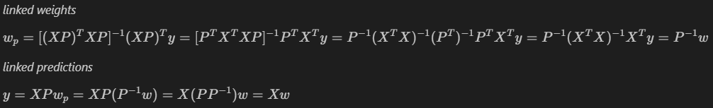

# Sprint 11: Linear Algebra – Matrix Obfuscation Exploration

---

## Project Overview

This project explored the application of linear algebra concepts, with a particular focus on matrix obfuscation techniques. The goal was to understand how matrices can be used to transform, encode, and obscure data, and to gain hands-on experience with matrix operations in a data science context.

---

## Matrix Obfuscation Visualization

A key part of the project was visualizing the effects of matrix transformations and obfuscation. The image below illustrates some of the mathematical concepts and transformations explored:

*Figure: Visual representation of matrix operations and obfuscation techniques.*

---

## Project Highlights

- Investigated the properties and applications of matrices in data science
- Implemented matrix transformations and obfuscation algorithms
- Explored the impact of different matrix operations on data structure and recoverability
- Developed a deeper understanding of linear algebra’s role in data security and encoding

---

## Outcome

The project provided valuable insights into the power of linear algebra for data manipulation and security. By experimenting with matrix obfuscation, the work laid a foundation for future applications in cryptography, secure data transmission, and advanced machine learning techniques.

---

## Resources

- [Project Notebook](s11_linear_algebra.ipynb)

---

[⬅️ Back to Main README](../../README.md)