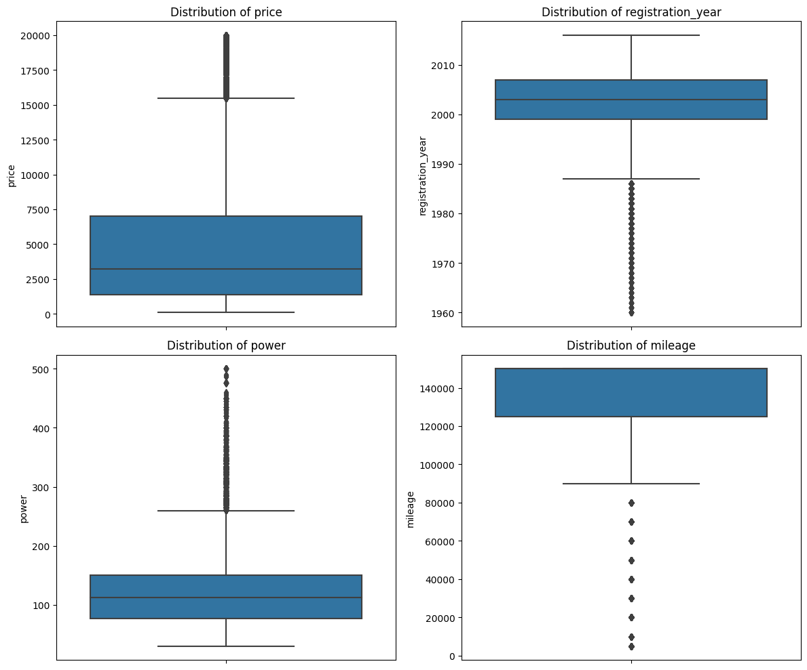

# Sprint 12: Numerical Methods – Used Car Price Prediction

---

## Project Overview

This project focused on building predictive models to estimate the market value of used cars for the Rusty Bargain sales service. The analysis included extensive data cleaning, feature engineering, and the application of various regression algorithms to optimize both prediction quality and computational efficiency.

---

## Data Visualization

A key part of the project was exploring the distributions and relationships between car features and their market prices. The visualization below summarizes some of the most important factors influencing car value:

*Figure: Key features and their distributions in the used car dataset.*

---

## Project Highlights

- Cleaned and prepared a large, real-world dataset of used car listings
- Engineered features and handled missing values and outliers
- Compared multiple regression models, including Linear Regression, Random Forest, LightGBM, and CatBoost
- Tuned hyperparameters and evaluated models using RMSE and computational speed

---

## Business Impact

The best-performing model, LightGBM, achieved the highest accuracy and fastest prediction times, making it ideal for real-time price estimation in the Rusty Bargain app. By providing reliable and instant price predictions, the model enhances user experience and supports better business decisions, helping Rusty Bargain attract and retain more customers in a competitive market.

---

## Outcome

- **LightGBM** was recommended for deployment due to its superior balance of speed and accuracy
- The model enables users to quickly and confidently assess the value of their vehicles, streamlining the sales process and increasing customer trust

---

## Resources

- [Project Notebook](s12_numerical_methods.ipynb)
- [Project Report (HTML)](https://avonmims.github.io/TripleTen_Data_Science/School-Projects/Sprint-12-Numerical-Methods/s12_display.html)

---

[⬅️ Back to Main README](../../README.md)