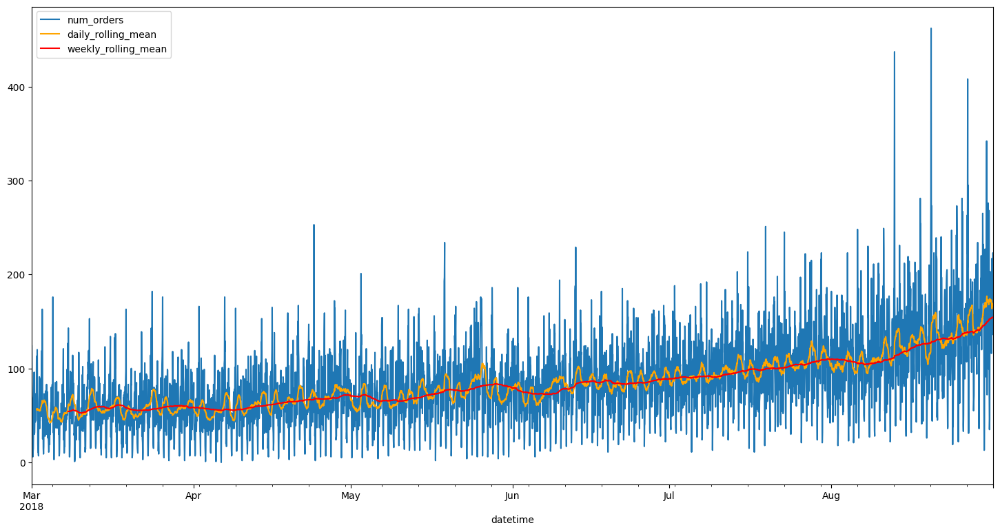

# Time Series Forecasting for Airport Taxi Demand

---

## Project Overview

This project focused on forecasting hourly taxi demand for Sweet Lift Taxi using historical order data. The goal was to build a predictive model that could help the company attract more drivers during peak hours by accurately forecasting the number of taxi orders for the next hour.

---

## Data Visualization

A key part of the analysis was exploring the time series patterns in taxi demand, including trends, seasonality, and anomalies. The visualization below highlights the cyclical and trend components identified in the data:

*Figure: Hourly taxi order volume with daily and weekly rolling averages.*

---

## Project Highlights

- Resampled raw data to hourly intervals and performed exploratory time series analysis
- Engineered features to capture temporal patterns (hour, day, day of week, lags, rolling means)
- Compared multiple forecasting models: Linear Regression, AutoRegression, ARIMA, and SARIMA
- Tuned model hyperparameters to optimize forecast accuracy

---

## Forecast Results & Outcomes

The best-performing model was a **SARIMA** model with parameters `order=(2, 1, 1)` and `seasonal_order=(1, 1, 1, 24)`. This model achieved a test set RMSE of **39.33**, beating the project goal of 48. The model successfully captured both the daily seasonality and overall trend in taxi demand, providing reliable forecasts for operational planning.

---

## Business Impact

By accurately forecasting hourly taxi demand, Sweet Lift Taxi can better allocate drivers during peak periods, reduce wait times for customers, and improve overall service efficiency. The forecasting solution supports data-driven decision-making and enhances the company’s ability to respond to changing demand patterns.

---

## Resources

- [Project Notebook](s13_time_series.ipynb)
- [Project Report (HTML)](https://avonmims.github.io/TripleTen_Data_Science/School-Projects/Sprint-13-Time-Series/s13_display.html)

---

[⬅️ Back to Directory](../../README.md)