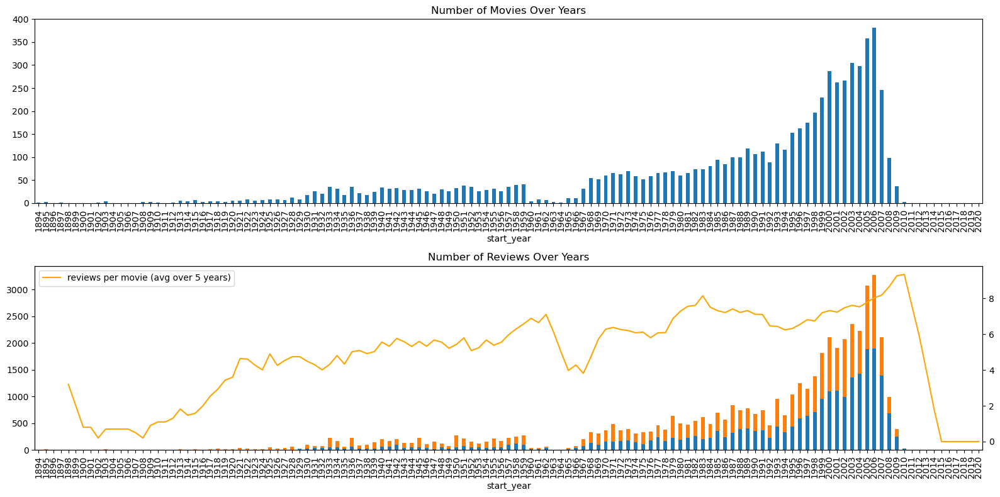

# Sprint 14: ML for Texts – Exploring NLP for Movie Review Classification

---

## Project Overview

This project explored the potential of Natural Language Processing (NLP) for classifying movie reviews as positive or negative. Using a dataset of IMDB reviews, the goal was to build and evaluate models that can automatically detect negative sentiment, supporting the development of a review filtering system for The Film Junky Union community.

---

## Data Visualization

A key part of the analysis was understanding the distribution and trends in movie reviews over time. The visualization below highlights key statistics from the dataset:

*Figure: Distribution and trends in IMDB movie reviews.*

---

## Project Highlights

- Preprocessed and normalized text data, including lemmatization and vectorization
- Explored and visualized review and rating distributions
- Trained and compared multiple models: DummyClassifier, Logistic Regression, XGBoost, and LightGBM
- Evaluated models using F1 score, ROC AUC, and other metrics
- Achieved an F1 score of **0.88** with Logistic Regression, surpassing the project threshold

---

## Outcome

The project demonstrated that even simple models, when paired with effective text preprocessing and vectorization, can achieve high accuracy in sentiment classification tasks. Logistic Regression emerged as the best model for this balanced dataset, offering fast training and robust performance without the need for extensive hyperparameter tuning.

---

## Resources

- [Project Notebook](s14_ml_texts.ipynb)

---

[⬅️ Back to Main README](../../README.md)