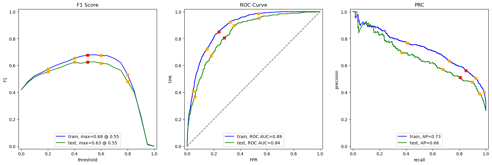

# Sprint 17: Customer Churn Prediction – Ensemble Modeling for Telecom

---

## Project Overview

This project focused on predicting customer churn for a telecommunications company using advanced machine learning techniques. The objective was to identify customers at risk of leaving, enabling targeted retention strategies and reducing revenue loss.

---

## Project Highlights

- Merged and cleaned four datasets (contract, internet, personal, phone) on customerID
- Engineered new features, including high/low risk customer flags and binary encodings
- Explored and compared multiple class imbalance strategies (SMOTE, upsampling, downsampling, class_weight)
- Evaluated a range of models: DummyClassifier, LogisticRegression, DecisionTree, RandomForest, XGBoost, CatBoost
- Tuned hyperparameters with GridSearchCV and combined top models in a soft-voting ensemble
- Visualized model performance with ROC-AUC, F1, and Precision-Recall curves

---

## Outcome

*Figure: Ensemble model performance metrics visualized.*

The final ensemble model (XGBoost + CatBoost) achieved:
- **F1 Score:** 0.6415
- **ROC-AUC:** 0.8516
- **Precision-Recall AUC:** ~0.67

This surpassed the project’s target metrics and demonstrated robust generalization on unseen data. Feature engineering and class balancing were key to success, and the ensemble approach outperformed individual models.

---

## Business Impact

The solution enables proactive identification and retention of high-risk customers, potentially reducing churn and increasing long-term revenue. The workflow and model can be adapted for similar customer retention challenges in other industries.

---

## Resources

- [Project Notebook](s17_solution.ipynb)
- [Project Report (HTML)](https://avonmims.github.io/TripleTen_Data_Science/School-Projects/Sprint-17-Final-Project/s17_display.html)

---

[⬅️ Back to Main README](../../README.md)