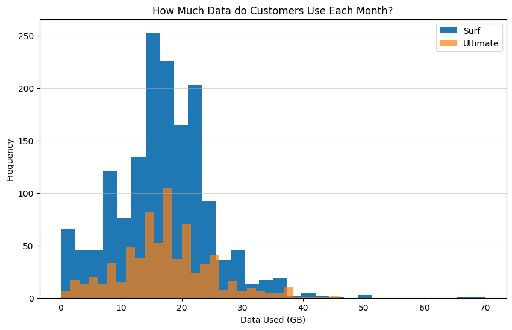

# Sprint 3: Statistical Data Analysis – Surf vs. Ultimate

---

## Project Overview

This project explores the differences in user behavior and profitability between two mobile plans—Surf and Ultimate—using real customer data. The analysis involved data cleaning, exploratory data analysis, and statistical hypothesis testing to provide actionable business recommendations.

---

## Data Usage Comparison

A key part of the analysis was visualizing and comparing the data usage patterns of Surf and Ultimate plan users. The chart below summarizes the findings and highlights the distinct usage distributions between the two plans:

*Figure: Distribution of data usage for Surf vs. Ultimate plan users.*

---

## Summary

- Cleaned and prepared multiple datasets for analysis
- Explored user behavior through visualizations and summary statistics
- Used hypothesis testing to compare plan performance
- Provided business recommendations based on statistical evidence

---

## Outcome

The analysis revealed clear differences in data usage patterns between the two plans. These insights informed recommendations for optimizing plan offerings and targeting specific customer segments.

---

## Resources

- [Project Notebook](Statistical-Data-Analysis-Surf-Vs-Ultimate.ipynb)
- [Project Report (HTML)](https://avonmims.github.io/TripleTen_Data_Science/School-Projects/Sprint-3-Statistical-Data-Analysis-Surf-Vs-Ultimate/Statistical-Data-Analysis-Surf-Vs-Ultimate.html)

---

[⬅️ Back to Main README](../../README.md)