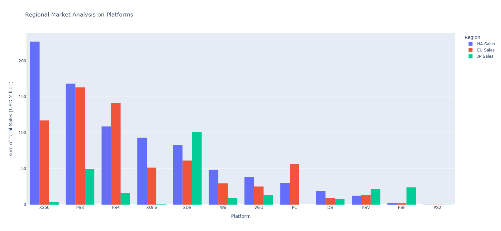

# Sprint 5: Integrated Project 1 – Video Game Analysis

---

## Project Overview

This project analyzes video game sales data to uncover trends and patterns in the global and regional markets. The analysis includes data cleaning, exploratory data analysis, and visualization to provide actionable insights for game publishers and marketers.

---

## Regional Market Preview

A key part of the analysis was comparing sales performance across different regions. The visualization below provides an overview of market differences:

*Figure: Video game sales distribution across major regions.*

---

## Summary

- Cleaned and prepared the video game sales dataset for analysis
- Explored sales trends by year, platform, genre, and region
- Visualized key patterns and differences in regional markets
- Provided recommendations for targeting specific markets and optimizing game releases

---

## Outcome

The analysis revealed significant differences in game popularity and sales performance across regions. These insights can help publishers tailor their strategies to maximize success in each market.

---

## Resources

- [Project Notebook](Sprint-5-Video-Game-Analysis.ipynb)
- [Project Report (HTML)](https://avonmims.github.io/TripleTen_Data_Science/School-Projects/Sprint-5-Integrated-Project-1-Video-Game-Analysis/Sprint-5-Video-Game-Analysis.html)

---

[⬅️ Back to Main README](../../README.md)