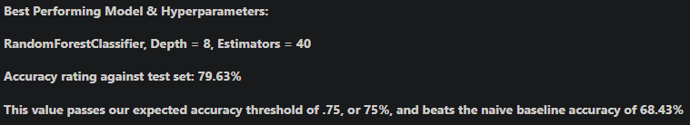

# Machine Learning for Personalized Cell Plan Recommendations

---

## Project Overview

This project served as an introduction to machine learning, focusing on building and evaluating simple classification models. The primary objective was to predict which new plan subscribers would choose based on their usage patterns.

---

## Project Highlights

- Explored and preprocessed a dataset of new plan subscribers
- Implemented and compared Decision Tree, Random Forest, and Logistic Regression models
- Tuned hyperparameters and evaluated model performance using accuracy
- Achieved a best test set accuracy of **79.63%** with a Random Forest Classifier, surpassing the baseline

---

## Conclusion

The project demonstrated the effectiveness of basic machine learning techniques for binary classification. The Random Forest model outperformed other approaches and exceeded the target accuracy threshold, providing a solid foundation for future, more advanced machine learning projects.

---

*Figure: Summary of model performance and final results.*

---

## Resources

- [Project Notebook](Sprint-7-Machine-Learning-Intro-Project.ipynb)
- [Project Report (HTML)](https://avonmims.github.io/TripleTen_Data_Science/School-Projects/Sprint-7-Machine-Learning-Intro-Project/Sprint-7-Machine-Learning-Intro-Project.html)

---

[⬅️ Back to Directory](../../README.md)