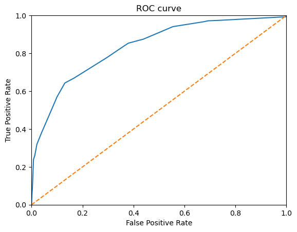

# Sprint 8: Supervised Learning Project

---

## Project Overview

This project focused on building and evaluating supervised learning models to predict customer churn. The workflow included data preprocessing, feature engineering, model selection, class balancing, and performance evaluation using key metrics.

---

## Project Highlights

- Explored and cleaned a real-world customer churn dataset
- Engineered features and handled missing values transparently
- Compared Decision Tree, Random Forest, and Logistic Regression models
- Addressed class imbalance using upsampling and class weighting
- Tuned model thresholds to optimize the F1 score

---

## Outcome

The best-performing model was a Decision Tree Classifier with balanced class weights and a tuned threshold, achieving:
- **F1 Score:** 0.604 (above the project threshold of 0.59)
- **Accuracy:** 0.822
- **AUC-ROC:** 0.834

These results indicate the model is effective at distinguishing between customers who will churn and those who will not, providing a strong foundation for future improvements.

---

*Figure: Final model performance metrics evaluation.*

---

## Resources

- [Project Notebook](Sprint-8-Supervised-Learning-Project.ipynb)
- [Project Report (HTML)](https://avonmims.github.io/TripleTen_Data_Science/School-Projects/Sprint-8-Supervised-Learning-Project/Sprint-8-Supervised-Learning-Project.html)

---

[⬅️ Back to Main README](../../README.md)