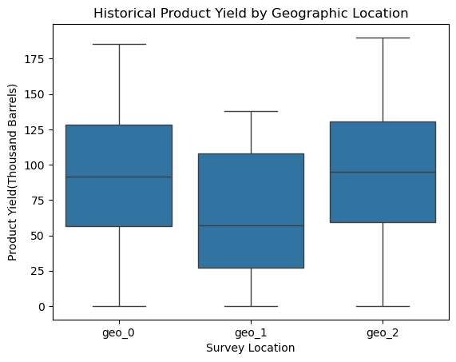

# Machine Learning for Oil Well Profitability & Risk Assessment

---

## Project Overview

This project applied machine learning techniques to optimize oil well development across three geographic regions. The analysis included exploratory data analysis, feature engineering, linear regression modeling, profit calculation, and risk assessment to guide business decisions.

---

## Regional Distributions

A key part of the analysis was visualizing the distribution of product yields across the three regions. The chart below highlights the differences in yield distributions, which informed both modeling and business strategy:

*Figure: Distribution of oil well product yields by region.*

---

## Project Highlights

- Performed thorough EDA and validated data integrity for all regions
- Engineered features and prepared data for modeling
- Trained and evaluated linear regression models for each region
- Calculated break-even yields and compared them to regional averages
- Implemented profit calculation and bootstrapping to estimate risk and confidence intervals

---

## Outcome

The analysis revealed that while some regions offered higher potential profits, they also carried unacceptable risks of loss. Location 1 (geo_1) demonstrated the lowest risk (2.1%) and the most consistent profit, meeting the project's criteria for safe investment. Based on the statistical evidence and business requirements, **Location 1 was selected as the optimal region for oil well development**.

---

## Resources

- [Project Notebook](machine_learning_in_business.ipynb)

---

[⬅️ Back to Directory](../../README.md)